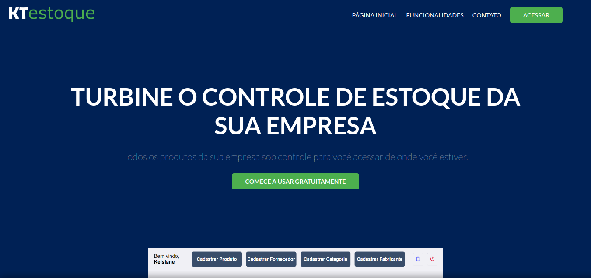
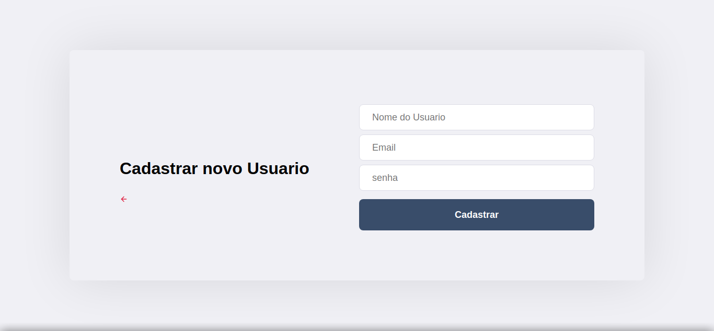

# KT estoque

# :rocket: Sobre o projeto

Projeto fullstack para fins educativos, esse projeto foi desenvolvido na disciplina de desenvolvimento web.

**VISITE EM: https://frontend-beta-roan.vercel.app/**

## :computer: Tecnologias utilizadas

- React js
- Express.js
- Jsonwebtoken
- PostgreSQL

## :construction_worker: Projeto na sua máquina

**Primeiramente você precisa ter instalado o [Node.js](https://nodejs.org/en/download/), depois efetuar o clone deste repositório a partir do seguinte comando:**

```
https://github.com/kelsiane/kt-estoque.git
```

URLs SSH fornecem acesso a um repositório Git via SSH, um protocolo seguro. Se você tiver uma chave SSH registrada em
sua conta do Github, clone o projeto usando este comando:

```
git@github.com:kelsiane/kt-estoque.git
```

# :art: Layout

<br />
<p align="center">
  
</p>
<p align="center">
  
</p>

<br/>

# :unlock: Licença

Lançado em 2021. Este projeto está sob a licença do MIT .

Feito com muita dedicação por Kelsiane Lima :zap:
